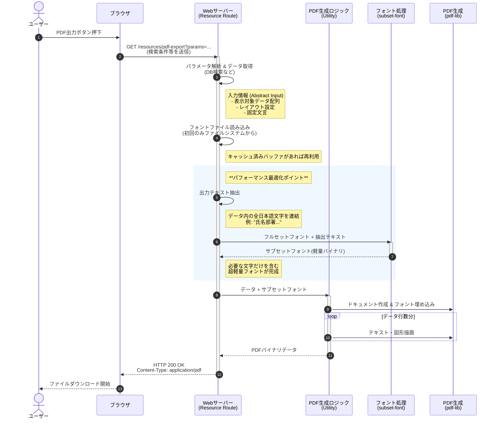

# サーバーサイドPDF生成（動的フォントサブセット化） 汎用シーケンス

このドキュメントは、`pdf-lib` と `subset-font` を用いた、日本語対応かつ軽量なPDF生成機能の処理フローを抽象化したものです。
特定の業務データ（ユーザーリスト等）に依存しないため、他の帳票出力機能などにも応用可能です。

## 処理のポイント

1.  **入力情報の抽象化**:
    - 特定のテーブル構造に依存せず、「表示したいテキスト」さえ抽出できれば、どのようなデータでも適用可能です。
2.  **動的サブセット化 (On-the-fly)**:
    - 事前にフォントセットを定義するのではなく、**「その時出力する文字」** だけを都度抽出してフォントを生成します。
    - これにより、人名や特殊な記号が含まれていても文字化けせず、かつファイルサイズを最小限（数KB〜数十KB）に抑えられます。
3.  **インメモリキャッシュ**:
    - 元となる巨大なフォントファイル（フルセット）は、サーバー起動後1回だけ読み込み、メモリに常駐させることでディスクI/Oを削減します。
