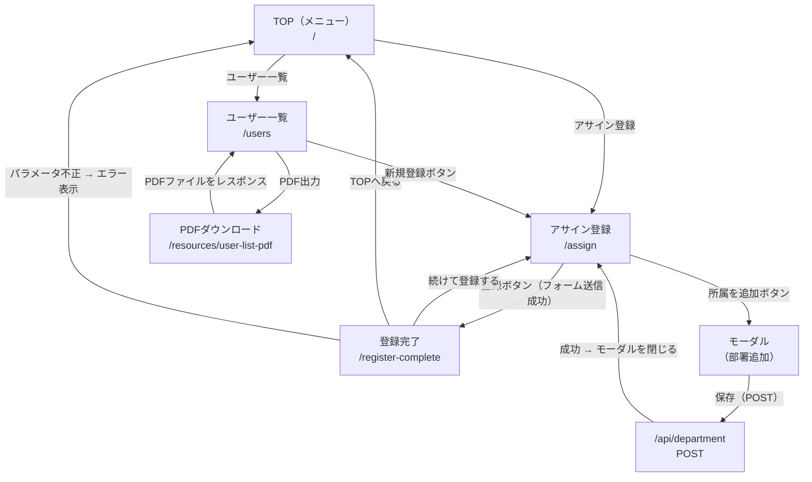

# 画面遷移図

## 画面一覧

| 画面名 | URL | ファイル |
|--------|-----|---------|
| TOP（メニュー） | `/` | `app/routes/home.tsx` |
| アサイン登録 | `/assign` | `app/routes/assign.tsx` |
| 登録完了 | `/register-complete` | `app/routes/register-complete.tsx` |
| ユーザー一覧 | `/users` | `app/routes/user-list.tsx` |

## API・リソースルート

| 種別 | URL | ファイル | 説明 |
|------|-----|---------|------|
| API | `/api/department` | `app/routes/api.department.ts` | 部署追加 |
| Resource Route | `/resources/user-list-pdf` | `app/routes/resources.user-list-pdf.ts` | PDFダウンロード |

## 遷移図



## 補足

- ユーザー一覧（`/users`）は `departmentId` / `employeeId` のクエリパラメータでフィルタリング可能
- PDF出力は現在のフィルタ条件をそのまま引き継ぐ
- 部署追加は `fetcher` を使ったバックグラウンド送信（画面遷移なし）
- ユーザー一覧の「条件クリア」はGETパラメータを削除して同画面を再表示（自己遷移）
```
